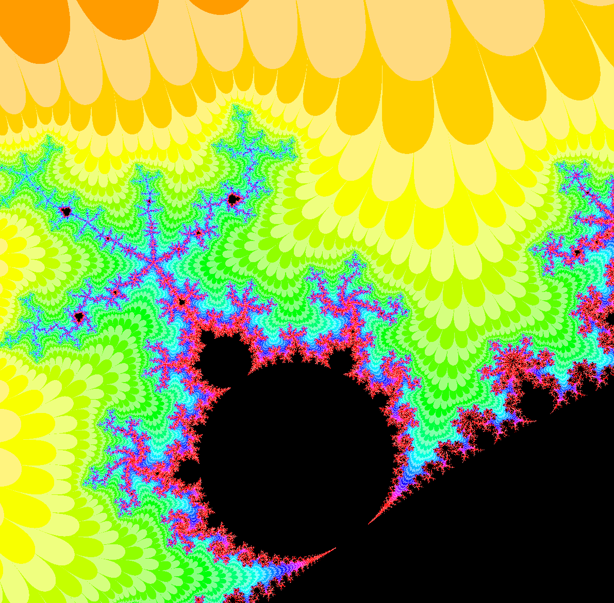

# The Mandelbrot Set
## A depiction of the mandelbrot set and its fractals

Use WASD for navigation

Use Z for Zoom and X to Zoom out

Use C for Colour and V to Reset Colour

This was my first project in Uni during the first two weeks of Java Bootcamp.

## Here are some Visuals

